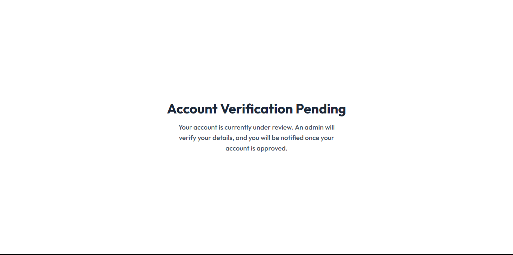

# Face Authentication App

Assessment project for Eaarth Studios — a secure face authentication system built using MERN stack and face recognition APIs.

## Tech Stack

- Frontend: React, Redux Toolkit, TailwindCSS, React Router, react-toastify
- Backend: Node.js, Express.js, MongoDB, Mongoose, bcrypt, JWT
- Face Authentication: face-api.js
- Deployment: Local / Assessment purposes

## Features

- User registration with photo ID and selfie for face verification
- Login using face authentication
- Admin dashboard to verify/reject users
- Status-based routing (pending, verified, rejected)
- Minimal persistent state using Redux (no JWT persistence)

## Setup

### Backend

1. Go to backend folder:
   cd backend

2. Install dependencies
   npm install

3. Create .env file
   PORT=8000
   MONGO_URI=<Your MongoDB URI>
   ACCESS_TOKEN_SECRET=<Your JWT Secret>

4. node index.js

### frontend

1. Go to frontend folder:
   cd frontend

2. Install dependencies
   npm install

3. Start React
   npm run dev (development)
   the app will run on http://localhost:5173

## Usage

- Register a new user using Auth -> FaceAuth.
- Login as admin to verify users.
- View users on AdminDashboard.
- Pending and Rejected users cannot access protected routes.

## screenshots
1. Login Page
    
2. Login face Authentication page
    
3. Register page
    
4. Register face Authentication page
    
5. Admin Dashboard page
    
6. Account Verifcation Pending page (after user login/register)
    

## Notes

- Login is **not persisted**; JWT token is stored in memory/cookie for session only.
- For assessment purposes, no deployment.

## Author
Muhamed Razik